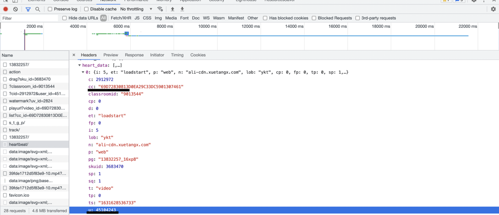

# yuCourseScript

> 刷云课堂视频脚本，使用python编写。 
>
> 2021-9-15 ：v1

### 使用

> 其中`yuCourseScript.ipynb`是notebook的格式，和`main.py`选择一个即可

为了使用，我们需要去获取几个请求的参数。

1. 使用手机扫码登陆云课堂，
2. 使用F12进入开发者模式，点击network。
3. 任意打开一个课程的视频。在开发者模式找到name为`heartbeat/`的请求
4. 在请求中拿到以下需要修改的参数，并更新到程序中。

`csrftoken，sessionid，cc，u`


```python
#所需要的参数,
#从那获得？微信扫码，进去之后按f12，打开network。找到heartbeat的请求。在请求中分别找到
user_id = 45104243
cc = "9FE88481F8F872F39C33DC5901307461"
csrftoken = "TFnYP9W2OGUh3EEMN3M25bgyR5lqG99w"
sessionid = "mufi4soizcrv8w3gtphutbds0bekq0j8"
# 刷前两门课程。
num_coures = 2
#请求间隔时间。
sleep_time = 1.0
#学校ID，郑大默认是2824
university_id = '2824'
```





[参考1](https://www.liaoxuefeng.com/wiki/1016959663602400/1183249464292448)  [参考2](https://github.com/WolfIsMyName/yuketangHelper)